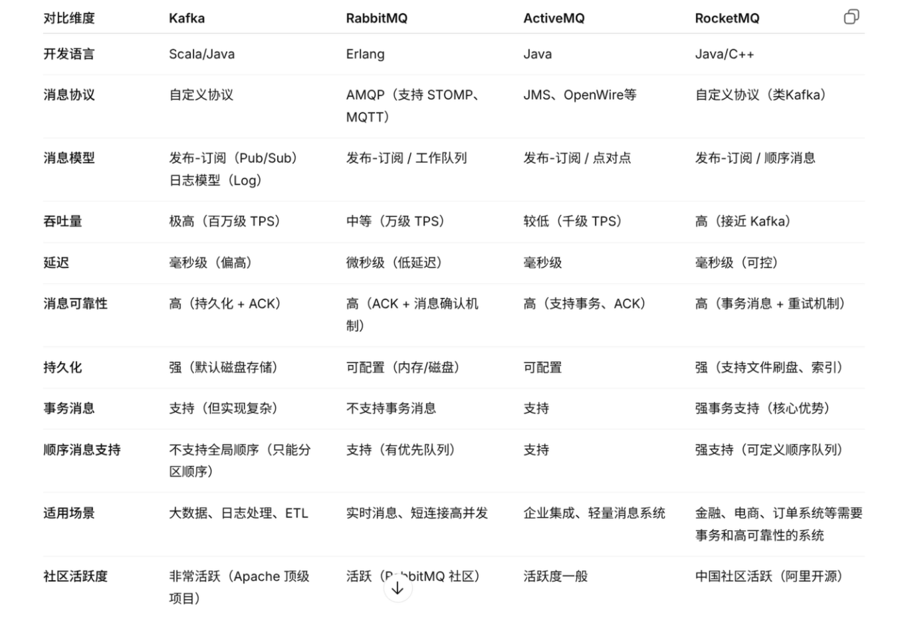
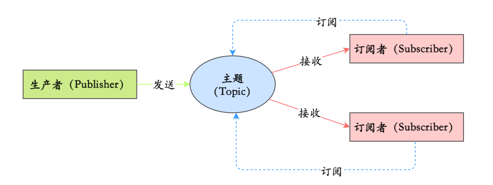
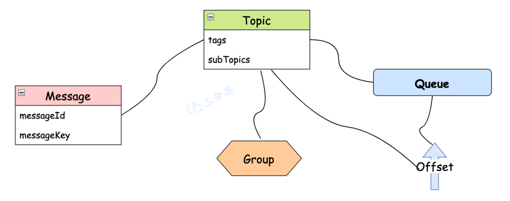

### 中间件

中间件（Middleware）技术是位于操作系统与应用程序之间的软件层，其主要作用是屏蔽底层复杂性、提供通用服务、实现系统之间的通信与协作。你可以将中间件理解为系统中的“胶水”或“桥梁”，它连接不同的组件，使它们可以协同工作，尤其是在分布式系统中起着关键作用。


# 1.为什么要使用消息队列

消息队列是一种非常重要的中间件技术，广泛应用于分布式系统中，以提高系统的可用性、解耦能力和异步通信效率。

### `解耦`

生产者将消息放入队列，消费者从队列中取出消息，这样一来，生产者和消费者之间就不需要直接通信，生产者只管生产消息，消费者只管消费消息，这样就实现了解耦。

### `异步`

系统可以将那些耗时的任务放在消息队列中异步处理，从而快速响应用户的请求。

### `削峰`

削峰填谷是一种常见的技术手段，用于应对系统高并发请求的瞬时流量高峰，通过消息队列，可以将瞬时的高峰流量转化为持续的低流量，从而保护系统不会因为瞬时的高流量而崩溃。

```shell
如何用RocketMQ做削峰填谷的？

用户请求到达系统后，由生产者接收请求并将其转化为消息，发送到 RocketMQ 队列中。队列用来充当缓冲区，将大量请求按照顺序排队，这样就可以削减请求高峰时对后端服务的直接压力。

不仅如此，生产者通过异步方式发送消息，还可以快速响应用户请求。

消费者从 RocketMQ 队列中按照一定速率读取消息并进行处理。可以根据后端处理能力和当前负载情况动态调整消费者的消费速率，达到填谷的效果。
```

# 2.为什么要选择 RocketMQ



RocketMQ 是阿里巴巴开源的一款分布式消息中间件，具有高吞吐量、低延迟和高可用性。其主要组件包括生产者、消费者、Broker、Topic 和队列。消息由生产者发送到 Broker，再根据路由规则存储到队列中，消费者从队列中拉取消息进行处理。适用于异步解耦和流量削峰等场景。

# 3.消息队列有哪些消息模型

### 队列模型

是最初的一种消息队列模型，对应着消息队列“发-存-收”的模型。生产者往某个队列里面发送消息，一个队列可以存储多个生产者的消息，一个队列也可以有多个消费者，但是消费者之间是竞争关系，也就是说每条消息只能被一个消费者消费。

### 发布/订阅模型

如果需要将一份消息数据分发给多个消费者，并且每个消费者都要求收到全量的消息。很显然，队列模型无法满足这个需求。解决的方式就是发布/订阅模型。

在发布/订阅模型中，消息的发送方称为发布者，消息的接收方称为订阅者，服务端存放消息的容器称为主题（Topic）。发布者将消息发送到主题中，订阅者在接收消息之前需要先“订阅主题”。“订阅”在这里既是一个动作，同时还可以认为是主题在消费时的一个逻辑副本，每份订阅中，订阅者都可以接收到主题的所有消息。



它和 “队列模式” 的异同：生产者就是发布者，队列就是主题，消费者就是订阅者，无本质区别。唯一的不同点在于：一份消息数据是否可以被多次消费。

# 4.RocketMQ 的消息模型

RocketMQ 使用的消息模型是标准的发布-订阅模型，在 RocketMQ 的术语表中，生产者、消费者和主题，与发布-订阅模型中的概念是完全一样的。



- `Message`

Message（消息）就是要传输的信息。

一条消息必须有一个主题（Topic）

- `Topic`

Topic（主题）可以看做消息的归类，它是消息的第一级类型。

- `Tag`

Tag（标签）可以看作子主题，它是消息的第二级类型，用于为用户提供额外的灵活性。

标签有助于保持你的代码干净和连贯，并且还可以为 RocketMQ 提供的查询系统提供帮助。

- `Group`

RocketMQ 中，订阅者的概念是通过消费组（Consumer Group）来体现的。每个消费组都消费主题中一份完整的消息，不同消费组之间消费进度彼此不受影响，也就是说，一条消息被 Consumer Group1 消费过，也会再给 Consumer Group2 消费。

- `Message Queue`

Message Queue（消息队列），一个 Topic 下可以设置多个消息队列，Topic 包括多个 Message Queue ，如果一个 Consumer 需要获取 Topic 下所有的消息，就要遍历所有的 Message Queue。

- `Offset`

在 Topic 的消费过程中，由于消息需要被不同的组进行多次消费，所以消费完的消息并不会立即被删除，这就需要 RocketMQ 为每个消费组在每个队列上维护一个消费位置（Consumer Offset），这个位置之前的消息都被消费过，之后的消息都没有被消费过，每成功消费一条消息，消费位置就加一。也可以这么说，Queue 是一个长度无限的数组，Offset 就是下标。

# 5.消息的消费模式

### 集群消费

默认情况下是集群消费，这种模式下一个消费者组共同消费一个主题的多个队列，一个队列只会被一个消费者消费，如果某个消费者挂掉，分组内其它消费者会接替挂掉的消费者继续消费。

### 广播消费

广播消费消息会发给消费者组中的每一个消费者进行消费。

# 6.如何保证消息的可用性/可靠性/不丢失

消息可能会在这三个阶段发生丢失：生产阶段、存储阶段、消费阶段。

### 生产

`生产阶段`主要通过`请求确认机制`，来保证消息的可靠传递。

1、同步发送的时候，要注意处理响应结果和异常。如果返回响应 OK，表示消息成功发送到了 Broker，如果响应失败，或者发生其它异常，都应该重试。

2、异步发送的时候，应该在回调方法里检查，如果发送失败或者异常，都应该进行重试。

3、如果发生超时的情况，也可以通过查询日志的 API，来检查是否在 Broker 存储成功。

### 存储

`存储阶段`可以通过`配置可靠性优先的 Broker 参数`来避免因为宕机丢消息，简单说就是可靠性优先的场景都应该使用同步。

1、消息只要持久化到日志文件中，即使 Broker 宕机，未消费的消息也能重新恢复再消费。

2、Broker 的刷盘机制：同步刷盘和异步刷盘，不管哪种刷盘都可以保证消息一定存储在 pagecache 中（内存中），但是同步刷盘更可靠，它是 Producer 发送消息后等数据持久化到磁盘之后再返回响应给 Producer。

3、Broker 通过主从模式来保证高可用，Broker 支持 Master 和 Slave 同步复制、Master 和 Slave 异步复制模式，生产者的消息都是发送给 Master，但是消费既可以从 Master 消费，也可以从 Slave 消费。同步复制模式可以保证即使 Master 宕机，消息肯定在 Slave 中有备份，保证了消息不会丢失。

### 消费

Consumer 保证消息成功消费的关键在于确认的时机，不要在收到消息后就立即发送消费确认，而是应该在执行完所有消费业务逻辑之后，再发送消费确认。因为消息队列维护了消费的位置，逻辑执行失败了，没有确认，再去队列拉取消息，就还是之前的一条。

# 7.如何处理消息重复的问题

RocketMQ 可以保证消息一定投递，且不丢失，但无法保证消息不重复消费(RocketMQ 的消费确认机制是 手动ACK)。因此，需要在业务端做好消息的`幂等性处理`或`消息去重`。

### 如何保证消息的幂等性？

首先，消息必须携带业务唯一标识(雪花算法)

其次，在消费者接收到消息后，判断 Redis 中是否存在该业务标志位，若存在标志位，则认为消费成功，否则执行业务逻辑，执行完成后，在缓存中添加标志位。

然后，利用数据库的唯一索引来防止业务的重复插入。

最后，在数据库表中使用版本号(乐观锁)。每次更新操作时检查版本号是否一致，只有一致时才执行更新并递增版本号。如果版本号不一致，则说明操作已被执行过，拒绝重复操作。

或者悲观锁机制，通过数据库的锁机制来保证幂等性。

### 雪花算法

雪花算法是一种分布式唯一 ID 生成算法

# 8.怎么处理消息积压

### 消费者扩容：

如果当前 Topic 的 Message Queue 的数量大于消费者数量，就可以对消费者进行扩容，增加消费者，来提高消费能力
### 消息迁移 Queue 扩容：

如果当前 Topic 的 Message Queue 的数量小于或者等于消费者数量，这种情况，再扩容消费者就没什么用，就得考虑扩容 Message Queue。可以新建一个临时的 Topic，临时的 Topic 多设置一些 Message Queue，然后先用一些消费者把消费的数据丢到临时的 Topic，因为不用业务处理，只是转发一下消息，还是很快的。接下来用扩容的消费者去消费新的 Topic 里的数据，消费完了之后，恢复原状。
